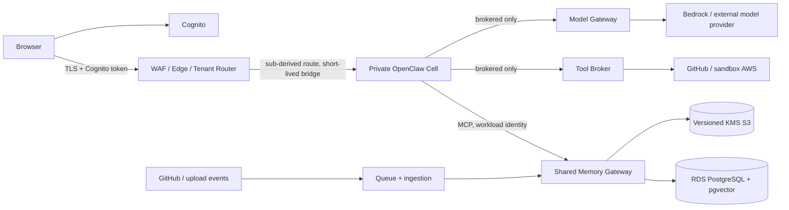
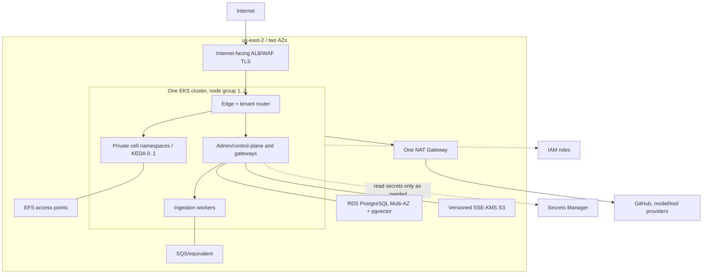
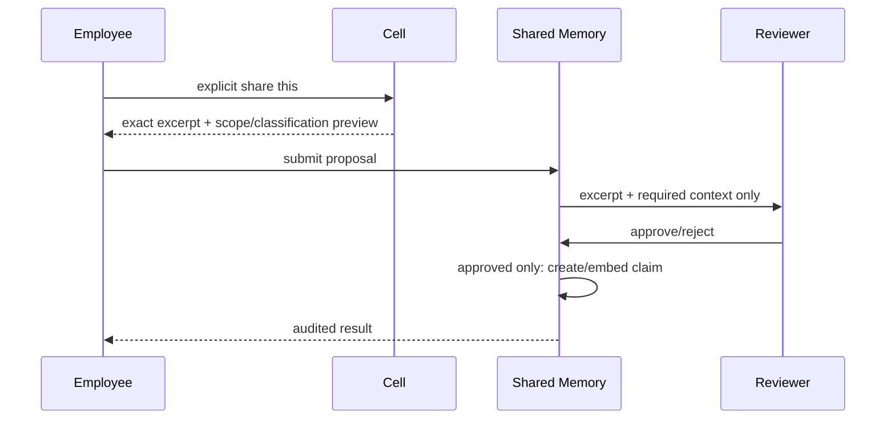
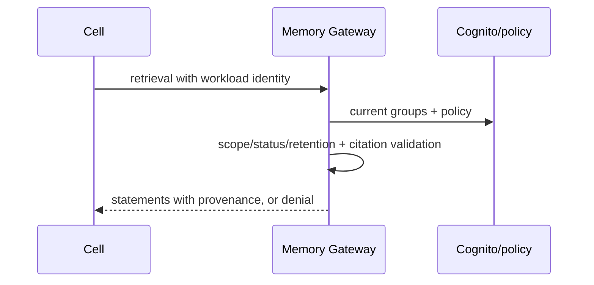

## Context

See [proposal.md](proposal.md) for motivation and [specs](specs) for behavior. This greenfield POC is a single-region, synthetic-only exploration for ten Cognito users (peak two active cells), not a production system or SOC 2 certification. No language, UI framework, model/provider list, budget, group-cache TTL, or department retention default is selected by this design.

## Goals / Non-Goals

**Goals:** establish a reviewable architecture for isolated user cells, governed shared knowledge, policy-enforced model/tool access, auditable administration, and measured component/AZ recovery.

**Non-Goals:** implementation, provisioning, real regulated data, production access, public signup, VM-grade tenant isolation, multi-region DR, and full email/calendar/Slack/Teams/connectors.

## Decisions

### System context and trust boundaries



Trust boundaries: browser-to-edge is public TLS; Cognito is the identity boundary; edge/router is the only public-to-cell routing boundary; cells are private per-user namespaces; gateways are platform policy-enforcement boundaries; RDS/S3/EFS are private data boundaries; connectors/providers are external boundaries. The router accepts identity only from a validated Cognito token and derives the cell from `sub`; no client cell identifier is trusted. Gateway workload identity is mapped to current Cognito membership before every sensitive decision. The exact Cognito-to-OpenClaw bridge and rotation cadence require a spike.

### AWS deployment and network/credential boundaries



Cells possess only cell-scoped workload identity, EFS access point, and rotated gateway credential; they have default-deny network egress and no model-provider, production, or cross-cell credentials. Gateways use least-privilege workload identity; external keys, if selected, remain in Secrets Manager. TLS protects public and service paths; KMS protects S3, database/storage services, and secrets according to AWS service capabilities. One NAT Gateway is an accepted cost reduction and single point of external-egress failure.

### Principal sequences

```mermaid
sequenceDiagram
 participant U as Browser
 participant C as Cognito
 participant R as Edge/router
 participant X as Cell
 U->>C: MFA sign-in
 C-->>U: validated token (sub, groups)
 U->>R: /cell + token
 R->>R: validate; derive cell from sub
 R->>X: private route + bridge credential
 X->>C: refresh membership when required
 X-->>U: cell session
```

```mermaid
sequenceDiagram
 participant U as User
 participant R as Router
 participant K as KEDA/Kubernetes
 participant X as Cell
 U->>R: authenticated /cell
 R->>K: request derived cell
 K->>X: scale 0 to 1
 X-->>R: ready or bounded timeout
 R-->>U: usable normally <=30s; otherwise retry-safe unavailable
```





```mermaid
sequenceDiagram
 participant U as Employee
 participant M as Memory Gateway
 participant V as Owner/governance
 U->>M: dispute claim
 M->>M: disputed; remove ordinary retrieval
 M->>V: immutable history + dispute
 V->>M: restore or versioned supersession
```

```mermaid
sequenceDiagram
 participant X as Cell
 participant M as Shared Memory
 X->>M: bounded retrieval
 M--x X: timeout/outage
 X->>X: open circuit; private-only mode
 X-->>X: continue private conversation
```

### Authorization and data model

Policy evaluation is: authenticate Cognito `sub`; resolve current Cognito groups; combine applicable valid memory grants; apply corporate deny/ceiling; then department policy inside ceiling; evaluate scope, classification, retention, claim/version status, and resource constraints. An explicit deny always wins; a valid grant adds only otherwise-permitted access. Corporate ceilings live in GitOps, department runtime policies in the control-plane database, membership in Cognito, and publication/dispute state in Shared Memory Gateway.

High-level entities and relations: `user(sub)` ↔ `group`; `user` → one `cell`; `policy` has scope/version/source; `document` → immutable `document_version` → `claim` → immutable `claim_version`; `proposal` → `approval|rejection`; `dispute` targets claim/version; `retrieval_citation` records returned claim/version/source validation; `connector_configuration`, `model_policy`, and `tool_policy` reference policy versions; `audit_event` references actor, subject, resource, decision, timestamp, and correlation ID. Original document bytes are S3 objects; metadata/embeddings/governance/audit references are PostgreSQL.

| Store | Authoritative ownership / purpose |
|---|---|
| Cognito | identity, MFA, membership |
| RDS PostgreSQL | control-plane runtime policies; documents/versions, claims/versions, proposals, approvals, disputes, citations, audit references, pgvector |
| S3 | versioned KMS-encrypted original documents and upload source versions |
| EFS | owning cell's private workspace/session state only |
| Secrets Manager | external provider and bridge secret material, never cell-readable by default |
| CloudWatch | operational logs/metrics/traces; not the application decision source |
| CloudTrail | AWS API audit source |

### Measurable POC outcome traceability

The eventual POC validation report SHALL use the following stable evidence identifiers; each row maps a proposal outcome to its capability contract and scenario.

| Measurable outcome | Capability / requirement | Scenario | Eventual test evidence |
|---|---|---|---|
| Ten MFA users receive authoritative groups | `identity-and-membership` / `Cognito identity authority` | `Authentication` | `POC-ID-01` identity/group evidence |
| Cross-cell and unauthorized department access is denied | `openclaw-cell-isolation` / `Dedicated cell boundary`; `private-and-shared-memory` / `Authorized shared retrieval and degradation` | `Cross-cell attempt`; `Sales access to HR` | `POC-AUTH-01` isolation denial evidence |
| Multiple-group grants are additive and deny prevails | `identity-and-membership` / `Membership decision semantics` | `Multi-group union`; `Corporate deny` | `POC-AUTH-02` policy-precedence evidence |
| Forged public cell identifier cannot alter routing | `tenant-routing` / `Token-derived cell routing` | `Forged cell identifier` | `POC-ROUTE-01` forged-route evidence |
| Idle cell normally wakes within 30 seconds | `cell-lifecycle` / `Scale-to-zero and wake` | `Normal cold start`; `Capacity or wake timeout` | `POC-LIFE-01` cold-start timing evidence |
| Private content is shared only through review | `private-and-shared-memory` / `Private memory and explicit sharing`; `knowledge-governance` / `Proposal and approval gate` | `Unshared private content`; `Reviewer privacy`; `Rejected claim` | `POC-MEM-01` sharing/reviewer evidence |
| Shared statements are current and provenance-validated | `provenance-and-disputes` / `Server-validated provenance` | `Citation validation`; `Stale version`; `Deleted source` | `POC-PROV-01` citation/version evidence |
| Disputes quarantine claims | `provenance-and-disputes` / `Dispute and supersession` | `Immediate quarantine` | `POC-GOV-01` dispute evidence |
| GitHub/S3 ingestion is protected and idempotent | `knowledge-ingestion` / `Idempotent asynchronous ingestion`, `GitHub webhook authenticity` | `Replayed event`; `Forged webhook`; `Processing failure` | `POC-ING-01` delivery/retry evidence |
| Model access and credentials are governed | `model-governance` / `Intersection model selection`, `Credential isolation` | `Disallowed model`; `Credential exfiltration attempt` | `POC-MODEL-01` selection/secret-boundary evidence |
| Tool/egress and sandbox writes fail closed | `tool-and-egress-policy` / `Brokered tool and egress authorization`, `Approved sandbox writes` | `Denied egress`; `Broker timeout`; `Unapproved write` | `POC-TOOL-01` broker/approval evidence |
| Shared-memory loss preserves personal cell operation | `private-and-shared-memory` / `Authorized shared retrieval and degradation` | `Gateway outage` | `POC-DEGRADE-01` private-only evidence |
| Privileged/governance actions are auditable | `administration` / `Administrative audit record`; `security-audit-and-observability` / `Structured control audit` | `Policy change audit`; `Denial evidence` | `POC-AUDIT-01` complete audit-record evidence |
| Recovery meets stated scope or fails honestly | `reliability-and-recovery` / `Scoped recovery objectives`; `poc-validation` / `Mandatory acceptance evidence` | `Recovery exercise`; `Recovery target miss`; `EFS target exception` | `POC-REC-01` measured RTO/RPO and exception evidence |

### Recovery and cost posture

RDS Multi-AZ and PITR are primary shared-memory/control-plane recovery. For their component/AZ failures, the objectives are measured RTO no greater than 30 minutes and RPO no greater than 5 minutes. A miss fails the associated acceptance scenario; reporting a miss is not success. Versioned S3 supports source recovery. EFS personal-cell RPO feasibility is an explicit pre-implementation architecture spike; if it cannot meet its target, an approved documented exception with owner, expiry, and alternative is required and the target cannot be claimed as achieved. Regional loss is out of scope. Single region, one cluster/node group, baseline node capacity, RDS Multi-AZ, no OpenSearch/Karpenter/second region, and a single NAT reduce POC cost but limit capacity/resilience. Shared-memory failure is intentionally degraded to private-only, never a reason to lose the personal cell.

### Proposed ADRs and required spikes

Proposed ADRs: (1) per-user OpenClaw Gateway boundary; (2) Cognito sub-derived routing/credential bridge; (3) shared-memory PostgreSQL/pgvector plus S3 provenance; (4) precedence split between GitOps ceilings and runtime policy; (5) GitHub identity mode; (6) KEDA scale-to-zero transport; (7) single-NAT POC compromise; (8) EFS private-state recovery posture; (9) Terraform state split and OIDC delivery controls.

Required analysis/spikes, each with a pass/fail evidence artifact before implementation: OpenClaw WebSocket behavior behind KEDA HTTP scale-to-zero (including reconnect); Cognito bridge credential rotation; cell mapping/group-cache invalidation and revocation propagation target; cold-start under node pressure; server-side citation enforcement bypass attempts; EFS backup/restore RPO; pgvector latency/connection-pool limit at POC load; GitHub App versus per-user OAuth identity/permissions; NAT failure impact; and proof that runtime configuration cannot override GitOps corporate ceilings.

### Threat model summary

Principal threats are forged routing, token replay/stale group authorization, cross-namespace/storage access, private-content oversharing, poisoned/stale sources, citation bypass, provider/connector credential theft, tool/egress abuse, webhook replay, privileged-policy tampering, and availability failures. Mitigations are token-derived routes, refresh/fail-closed authorization, per-cell identities and default-deny networking, explicit review, server validation/versioning, gateways/secrets isolation, idempotency, immutable audit records, approval gates, WAF/TLS/KMS/least privilege, and measured recovery/degradation. This is SOC 2-aligned control exploration, not certification.

## Risks / Trade-offs

- [Single NAT / one cluster] → documented availability limits; exercise degraded modes and do not claim HA.
- [Namespace rather than VM isolation] → synthetic-only POC and explicit non-hostile-tenant limitation.
- [Unknown bridge/KEDA/EFS behavior] → implementation is gated on the named spikes.
- [Policy freshness vs latency] → do not choose cache TTL; define propagation objective during decision review and fail closed when unsafe.

## Migration Plan

This is a planning-only baseline: review/approve the artifacts, create the listed architecture documents/contracts/scaffolding, complete spikes, then implement only through small follow-on OpenSpec changes. Rollback is removal of unapproved planning artifacts; no runtime migration exists.

## Open Questions

Exact chat models/providers/budgets, language/UI framework, group-cache TTL/propagation objective, department retention defaults, bridge format/rotation interval, GitHub identity choice, and measured EFS/pgvector/KEDA limits remain decision inputs; none is silently selected here.
